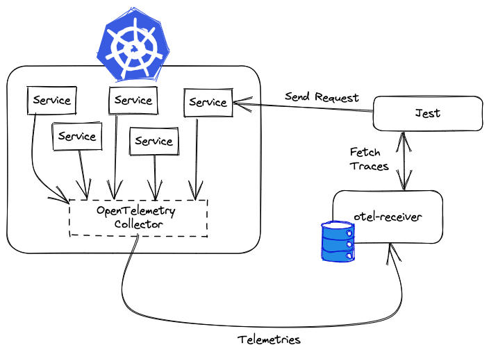

When you run a test, you will usually send a request to one of the services in your cluster and then monitor how they behave.
To do that, we use the data outputted by OpenTelemetry.

This data is collected by an OpenTelemetry instance called [Collector](https://opentelemetry.io/docs/collector/).
We connect to it by adding a new standard HTTP exporter (called `otlphttp`) within the collector.

<Accordion title="More on OpenTelemetry collectors">
  Collectors are built of 3 components: 
  
    * Receivers: Receives the data from the instrumented application 
    * Processors: Processes the data (e.g. filters, enriches, etc.) 
    * Exporters: Exports the data to a backend (e.g. Jaeger, Zipkin, etc.)

A standard container deployment of a collector exists where all of this is [configured in a YAML file](https://opentelemetry.io/docs/collector/configuration).
Basically adding the HTTP exporter for test is merely a configuration update.

</Accordion>

When Jest starts up, we starts another service called `otel-receiver` that receives the telemetries outputted from the `otlphttp` exporter.
It caches them all locally in memory. Then, when the actual test is ran, each of your assertions are tested against these cached traces.

<Frame>
  
</Frame>
