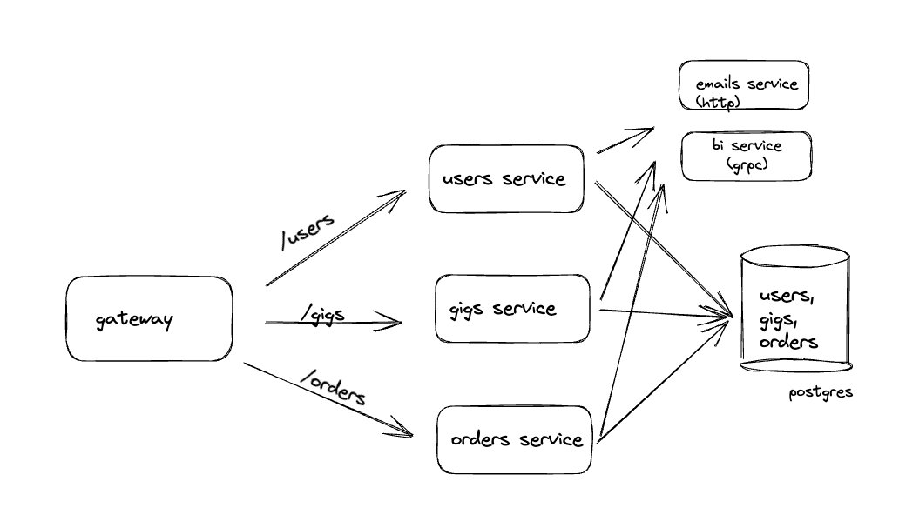

# test-servers

This is a test environment which sends telemetry data (by default to Traceloop servers).
A single container (listening on multiple ports) mimics different microservices that communicate via http and gRPC.

Services include:

- gateway
- users service
- gigs service
- orders service
- emails service
- bi grpc service

## Architecture

